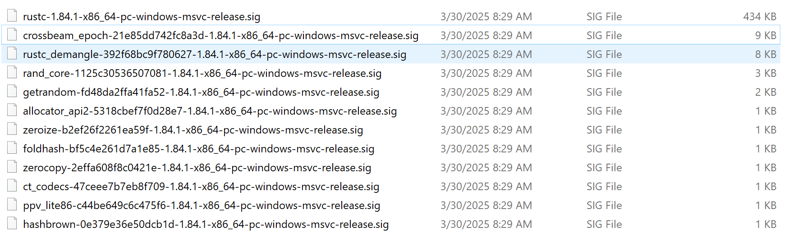

# Applying RIFT on RALORD

Step by step guide to apply RIFT on a ransomware written in rust, dubbed RALORD.
The guide assumes that RIFT is installed and set up as described in `readme.md`.

SHA256: 456b9adaabae9f3dce2207aa71410987f0a571cd8c11f2e7b41468501a863606

The application here stops with the generation of the flirt signatures.

## 1 RIFT Static Analyzer

Open up IDA, load the file and wait for IDA to finish its auto analysis.
Next, open RIFT Static Analyzer via Edit->Plugins->RIFT Static Analyzer

If you click "Print commithash", you should see a message of RIFT Static Analyzer, printing the identified commit hash.

Use the "Save metadata as json in" field to store the information, click "Ok". The output file looks similar to this:

```json

    "commithash": "e71f9a9a98b0faf423844bf0ba7438f29dc27d58",
    "target_triple": "pc-windows-msvc",
    "arch": "x86_64",
    "crates": [
        "rustc-demangle-0.1.24",
        "hashbrown-0.15.0",
        "orion-0.17.9",
        "core",
        "std",
        "crossbeam-epoch-0.9.18",
        "rand_core-0.6.4",
        "crossbeam-deque-0.8.6",
        "alloc",
        "rand-0.8.5",
        "rand_chacha-0.3.1",
        "backtrace",
        "rayon-core-1.12.1"
    ]
}
```

Depending on the version, we might have improved the rust crate recognition so it might differ.

## 2 RIFT Client

Take the JSON file, we are now feeding the results into the RIFT Client procedure. Your rift_config.cfg file needs to be adjusted to point to the corresponding tools:

```
[Default]
PcfPath = C:\RIFT\binaries\pcf.exe 
SigmakePath = C:\RIFT\binaries\sigmake.exe
DiaphoraPath = C:\diaphora\diaphora.py
IdatPath = C:\Program Files\IDA Professional 9.1\idat.exe
WorkFolder = C:\RIFT\work
CargoProjFolder = C:\RIFT\tmp
```

Now simply run `rift.py` to generate the corresponding FLIRT signatures.

```
py rift.py --cfg .\rift_config.cfg \
--input ..\ralord_static_1.json \
--flirt \
--output ..\RALORD_FLIRT
```

### 3 Application of Flirt Signatures

Check now the specified output folder, you should files similar to the ones displayed below.



Switch to Ida again, you can either apply the flirt signatures manually or run the helper script `scripts/ida_apply_flirt_from_folder.py`.