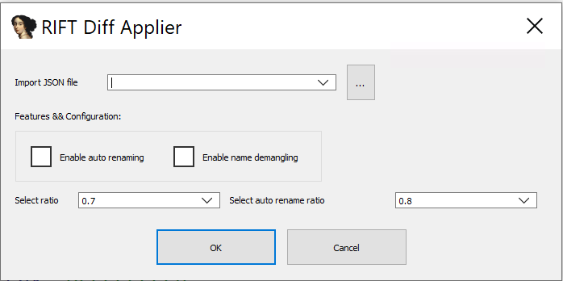
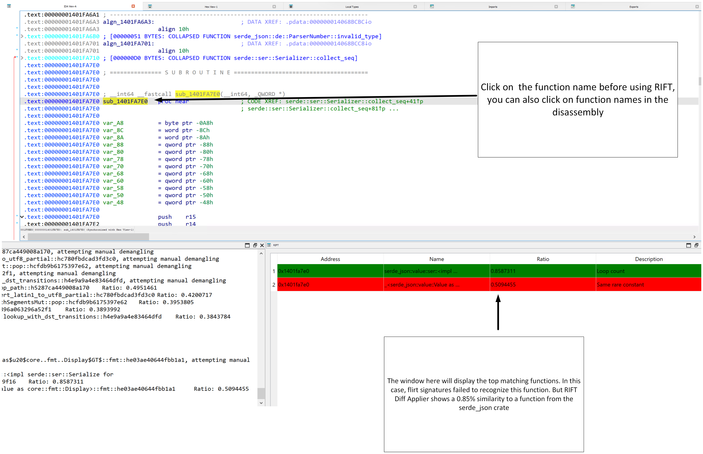

# Applying RIFT on SPICA

Step by step guide to apply RIFT on SPICA, mentioned in the following article:

https://blog.google/threat-analysis-group/google-tag-coldriver-russian-phishing-malware/

The guide assumes that RIFT is installed and set up as described in `readme.md`.

SHA256: 37c52481711631a5c73a6341bd8bea302ad57f02199db7624b580058547fb5a9


## 1 RIFT Static Analyzer

Open up IDA, load the file and wait for IDA to finish its auto analysis.
Next, open RIFT Static Analyzer via Edit->Plugins->RIFT Static Analyzer

If you click "Print commithash", you should see a message of RIFT Static Analyzer, printing the identified commit hash.

Use the "Save metadata as json in" field to store the information, click "Ok". The output file looks similar to this:

```json
{
{
    "commithash": "eb26296b556cef10fb713a38f3d16b9886080f26",
    "target_triple": "pc-windows-msvc",
    "arch": "x86_64",
    "crates": [
        "smallvec-1.11.0",
        "rayon-1.7.0",
        "tokio-util-0.7.8",
        "futures-core-0.3.28",
        "hashbrown-0.12.3",
        "ring-0.16.20",
        "aes-0.7.5",
        "ctr-0.8.0",
        "url-2.4.0",
        "futures-channel-0.3.28",
        "tokio-1.32.0",
        "hyper-rustls-0.24.1",
        "indexmap-1.9.3",
        "bytes-1.4.0",
        "percent-encoding-2.3.0",
        "idna-0.4.0",
        "windows-0.48.0",
        "crossbeam-epoch-0.9.15",
        "http-0.2.9",
        "color-spantrace-0.2.0",
        "mio-0.8.8",
        "rustls-pemfile-1.0.3",
        "color-eyre-0.6.2",
        "hashbrown-0.13.1",
        "hyper-0.14.27",
        "data-encoding-2.4.0",
        "backtrace",
        "unicode-normalization-0.1.22",
        "httparse-1.8.0",
        "backtrace-0.3.68",
        "rand-0.8.5",
        "rustls-0.21.6",
        "futures-util-0.3.28",
        "once_cell-1.18.0",
        "wmi-0.13.1",
        "tokio-tungstenite-0.19.0",
        "parking_lot-0.12.1",
        "panic_unwind",
        "reqwest-0.11.18",
        "crossbeam-channel-0.5.8",
        "utf-8-0.7.6",
        "spin-0.5.2",
        "serde-1.0.185",
        "serde_json-1.0.105",
        "want-0.3.1",
        "jwalk-0.8.1",
        "generic-array-0.14.7",
        "rayon-core-1.11.0",
        "ipnet-2.8.0",
        "crossbeam-deque-0.8.3",
        "socket2-0.4.9",
        "tokio-rustls-0.24.1",
        "tungstenite-0.19.0",
        "cipher-0.3.0",
        "alloc",
        "open-4.2.0",
        "form_urlencoded-1.2.0",
        "slab-0.4.8",
        "sct-0.7.0",
        "rand_core-0.6.4",
        "tinyvec-1.6.0",
        "std",
        "tar-0.4.40",
        "core",
        "base64-0.21.2",
        "rustls-webpki-0.101.3",
        "rusqlite-0.25.4",
        "rustc-demangle-0.1.23",
        "rustc-demangle-0.1.21",
        "parking_lot_core-0.9.8",
        "sysinfo-0.28.4",
        "untrusted-0.7.1",
        "ahash-0.7.6",
        "h2-0.3.20"
    ]
}
```

Depending on the version, we might have improved the rust crate recognition so it might differ.

## 2 RIFT Client

Take the JSON file, we are now feeding the results into the RIFT Client procedure. Your rift_config.cfg file needs to be adjusted to point to the corresponding tools:

```
[Default]
PcfPath = C:\RIFT\binaries\pcf.exe 
SigmakePath = C:\RIFT\binaries\sigmake.exe
DiaphoraPath = C:\diaphora\diaphora.py
IdatPath = C:\Program Files\IDA Professional 9.1\idat.exe
WorkFolder = C:\RIFT\work
CargoProjFolder = C:\RIFT\tmp
```

Now simply run `rift.py` to generate the corresponding FLIRT signatures. This time, we will also collect the binary diffing information. First, use Diaphora to generate the diffing information.

```
py rift.py --cfg .\rift_config.cfg \
--input ..\ralord_static_1.json \
--flirt \
--binary-diff \
--target C:\RIFT\Targets\SPICA.db \
--output ..\SPICA_FLIRT \
--diff-output SpicaDiffInfo.json
```

The diffing process will take a large amount of time. In this case, SPICA has quite many crates embedded, so you'll likely need to wait more than 5 hours till its finished. We are working on speeding up this process. FLIRT signature creation is still quick.

### 3 Application of Flirt Signatures

Check now the specified output folder, you should see a number of .sig files.

Switch to Ida again, you can either apply the flirt signatures manually or run the helper script `scripts/ida_apply_flirt_from_folder.py`.

### 4 Feed into RIFT Diff Applier

Open RIFT Diff Applier via Edit->Plugins->RIFT Diff Applier, a new window will pop up.



You can input the following values:

```
Import JSON file -> Load the JSON file containing diffing information
Enable auto renaming -> Based on auto rename ratio, rename functions automatically
Enable name demangling -> Attempt to fix symbols from COFF files (experimental)
Select ratio -> Minimum similarity ratio 
Select auto rename ratio -> Minimum similarity ratio for auto renaming 
```

Select the JSON file you generated in step 6, enable name demangling and keep the ratio at 0.7.

Once you click "Okay", the window will close. Here is what just happened:

* Context Menu Items under "RIFT/" have been installed. Right click on a function name and you will see the context menu "RIFT/"
* A hotkey for "CTRL+X" has been installed, instead of using the context menu item, you can use the hotkey
* A new window was generated with the title "RIFT". Top matching functions will be displayed here

To test it, always click on the function name in the disassembly window. Take for example `sub_1401FA7E0`


